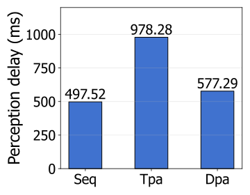
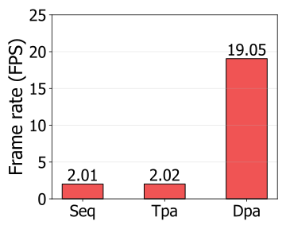
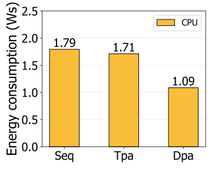
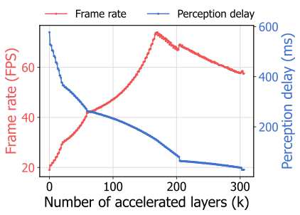
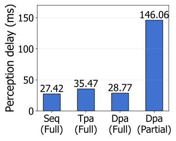
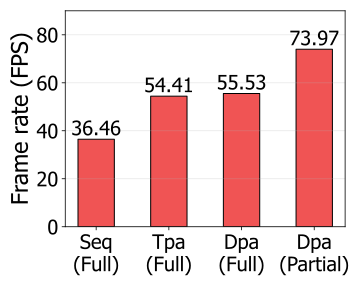
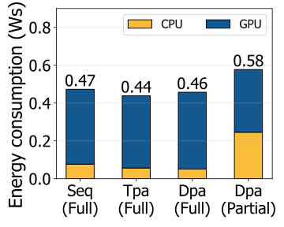

# Data-parallel Framework
Darknet frame rate & delay optimization 

### ※ We use NVIDIA Jetson AGX Orin 32GB which has 12 CPU cores, and our code is based on this hardware platform. 

# Setup
## Power Mode Setting
```
# open /etc/nvpmodel.conf to configure power mode
$ sudo gedit /etc/nvpmodel.conf
```

```
# copy and paste below code to nvpmodel configuration file
< POWER_MODEL ID=4 NAME=GPU_FREQ_100 >
CPU_ONLINE CORE_0 1
CPU_ONLINE CORE_1 1
CPU_ONLINE CORE_2 1
CPU_ONLINE CORE_3 1
CPU_ONLINE CORE_4 1
CPU_ONLINE CORE_5 1
CPU_ONLINE CORE_6 1
CPU_ONLINE CORE_7 1
CPU_ONLINE CORE_8 1
CPU_ONLINE CORE_9 1
CPU_ONLINE CORE_10 1
CPU_ONLINE CORE_11 1
TPC_POWER_GATING TPC_PG_MASK 0
GPU_POWER_CONTROL_ENABLE GPU_PWR_CNTL_EN on
CPU_A78_0 MIN_FREQ -1
CPU_A78_0 MAX_FREQ -1
CPU_A78_1 MIN_FREQ -1
CPU_A78_1 MAX_FREQ -1
CPU_A78_2 MIN_FREQ -1
CPU_A78_2 MAX_FREQ -1
GPU MIN_FREQ 1224000000
GPU MAX_FREQ 1300500000
GPU_POWER_CONTROL_DISABLE GPU_PWR_CNTL_DIS auto
EMC MAX_FREQ 0
DLA0_CORE MAX_FREQ -1
DLA1_CORE MAX_FREQ -1
DLA0_FALCON MAX_FREQ -1
DLA1_FALCON MAX_FREQ -1
PVA0_VPS MAX_FREQ -1
PVA0_AXI MAX_FREQ -1
```

## OpenBLAS
```
$ git clone https://github.com/AveesLab/OpenBLAS.git
$ cd OpenBLAS
$ ./setup.sh
```

# Implementation

## Sequential Architecture


- **Perception Delay** : **Optimal**, with no additional delay
- **Frame Rate** : **Worst**, by a single CPU core's performance

```
# use GPU as Inference
./sequential_test.sh -model {model} -isGPU 1

# use CPU as Inference
./sequential_test.sh -model {model} -isGPU 0
```

## Pipeline Architecture

 

- **Perception Delay** : **Worst**, additionally delayed due to pipleine stalls
- **Frame Rate** : **Enhanced**, however, limited by the performance of three CPU cores

```
# use GPU as Inference
./pipeline_test.sh -model {model} -isGPU 1

# use CPU as Inference
./pipeline_test.sh -model {model} -isGPU 0
```

## Data-Parallel Architecture


- **Perception Delay** : **Nerar-optimal**, despite minor memory contention delay
- **Frame Rate** : **Optimal**, by maximally utilizing all the CPU cores (*M* cores)

```
./data_parallel_test.sh -model {model}
```

## Partial DNN Acceleration Architecture


We partially accelerate (only **front *k***) layers to balance frame rate and perception delay. So you can find delay optimal & frame rate optimal

```
./gpu_accel_test.sh -model {model}
```

## Evaluation

- **Seq** : Sequential Architecture
- **Tpa** : Task-parallel Architecture
- **Dpa** : Data-parallel Architecture
- **Seq(Full)** : Sequential Architecture with Full GPU Acceleration
- **Tpa(Full)** : Task-parallel Architecture with Full GPU Acceleration
- **Dpa(Full)** : Data-parallel Architecture with Full GPU Acceleration
- **Dpa(Partial)** : Data-parallel Architecture with Partial GPU Acceleration

### Evaluation of Our Data-parallel Architecture

 
 


- Dpa achieves the highest frame rate of 19.05 FPS, outperforming Seq and Tpa.
- Dpa exhibits slightly increased perception delay from Seq due to memory contention. 
- Dpa shows the best energy efficiency by utilizing all the given CPU cores.

### Frame Rate Optimization by Partial GPU Acceleration

 
 

 - Increasing the number of accelerated layers (𝑘) continually reduces perception delay.
 - Frame rate increases until reaching the optimal frame rate (73.97 FPS) with 𝑘=169.
 - Then the frame rate decreases as the GPU becomes more and more serious bottleneck.


### Data-parallel Architecture with Partial GPU Acceleration

  

 - Dpa (Partial) achieves the optimal frame rate, however, with limited delay reduction.
 - Dpa (Full) shows near-optimal perception delay, but suboptimal frame rate.
 - Dpa (Partial) consumes more energy by making both CPU and GPU fully busy.
 - Two choices ( Dpa (Full) – delay optimal or Dpa (Partial) – frame rate optimal). 


## Citaion
```
@InProceedings{Ahn_2023_ML4AD,
    author    = {Sol Ahn, Seungha Kim, Ho Kang,Jong-Chan Kim},
    title     = {Data-parallel Real-Time Perception System with Partial GPU Acceleration for Autonomous Driving},
    booktitle = {Proceedings of the Machine Learning for Autonomous Driving (ML4AD)},
    month     = {December},
    year      = {2023},
    pages     = {}
}
```