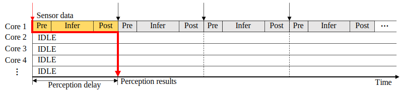
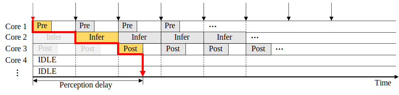
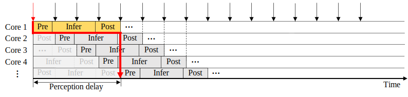
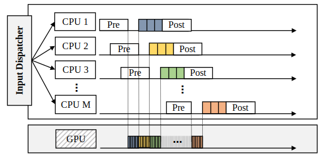

# Data-Parallel Framework

Optimizing Darknet Frame Rate & Delay

### ✪ Target Hardware
We use **NVIDIA Jetson AGX Orin 32GB** (12-core CPU) as our primary development and evaluation platform.

---

# Setup

## Install OpenBLAS and BLIS

```bash
$ chmod +x *.sh
$ ./setting.sh
```
This script installs and configures OpenBLAS and BLIS for optimized CPU performance.

---

# Implementation

## Sequential Architecture



- **Perception Delay**: Optimal, with no additional delay.
- **Frame Rate**: Worst, limited by single CPU core performance.

Run:
```bash
# Using GPU for inference
./sequential_test.sh -model {model} -isGPU 1

# Using CPU for inference
./sequential_test.sh -model {model} -isGPU 0
```

---

## Pipeline (Task-Parallel) Architecture



- **Perception Delay**: Worst, additional delay due to pipeline stalls.
- **Frame Rate**: Improved, but limited by three CPU cores.

Run:
```bash
# Using GPU for inference
./pipeline_test.sh -model {model} -isGPU 1

# Using CPU for inference
./pipeline_test.sh -model {model} -isGPU 0
```

---

## Data-Parallel Architecture



- **Perception Delay**: Near-optimal, slight delay due to memory contention.
- **Frame Rate**: Optimal, leveraging all CPU cores (M cores).

Run:
```bash
./data_parallel_test.sh -model {model}
```

---

## Partial DNN Acceleration Architecture



We partially accelerate the first *k* layers of the network to balance frame rate and perception delay.

Run:
```bash
./gpu_accel_test.sh -model {model}
```

---

# Evaluation

### Architecture Types
- **Seq**: Sequential Architecture
- **Tpa**: Task-parallel Architecture (Pipeline)
- **Dpa**: Data-parallel Architecture
- **Seq(Full)**: Sequential with Full GPU Acceleration
- **Tpa(Full)**: Task-parallel with Full GPU Acceleration
- **Dpa(Full)**: Data-parallel with Full GPU Acceleration
- **Dpa(Partial)**: Data-parallel with Partial GPU Acceleration

---

### Performance of Data-Parallel Architecture

  

- **Frame Rate**: Highest at 19.05 FPS, outperforming Seq and Tpa.
- **Perception Delay**: Slightly increased from Seq due to memory contention.
- **Energy Efficiency**: Best, utilizing all CPU cores effectively.

---

### Frame Rate Optimization with Partial GPU Acceleration

 

- Increasing the number of accelerated layers (k) reduces perception delay.
- Frame rate improves until reaching an optimal peak (73.97 FPS at k=169), then drops as GPU bottleneck intensifies.

---

### Data-Parallel Architecture with Partial GPU Acceleration

  

- **Dpa(Partial)**: Optimal frame rate, but limited perception delay improvement.
- **Dpa(Full)**: Near-optimal perception delay, but suboptimal frame rate.
- **Energy Consumption**: Dpa(Partial) consumes more energy by fully utilizing both CPU and GPU.

> **Choice**: Use Dpa(Full) for delay optimization or Dpa(Partial) for frame rate optimization.

---

# Citation

```bibtex
@InProceedings{Ahn_2023_ML4AD,
    author    = {Sol Ahn, Seungha Kim, Ho Kang, Jong-Chan Kim},
    title     = {Data-parallel Real-Time Perception System with Partial GPU Acceleration for Autonomous Driving},
    booktitle = {Proceedings of the Machine Learning for Autonomous Driving (ML4AD)},
    month     = {December},
    year      = {2023},
    pages     = {}
}
```

[ML4AD Workshop Link](https://ml4ad.github.io/)
